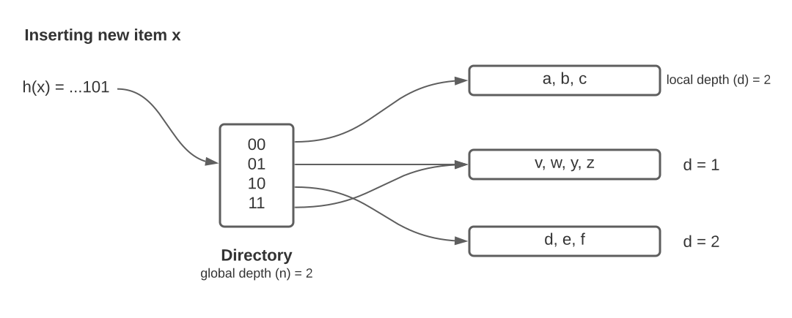
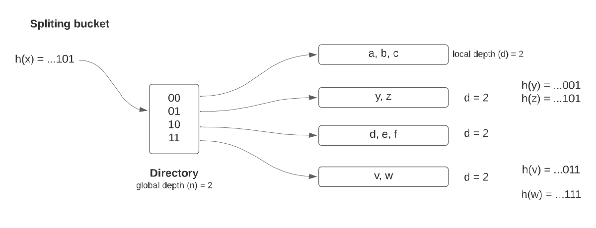
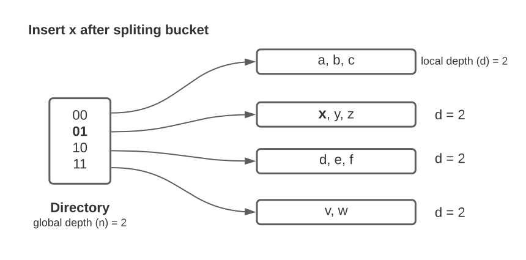
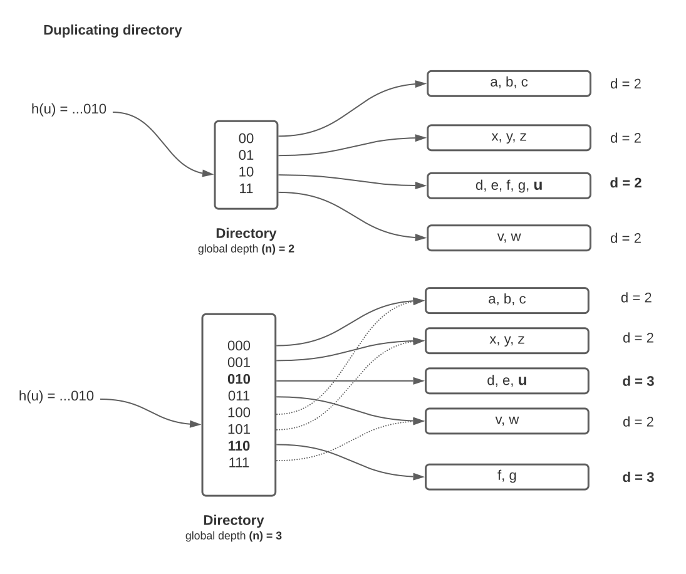

## ScriptsDistinct

### distinct_db.py
This script creates a special database for testing the Distinct operator, where all nodes are connected to each other and with all nodes as a connection type. This means that if we have N nodes, there will be N^3 connections.

### test_ordered_vs_hash.py
This script compares all querys (previously asked) made with both methods of the operator Distinct. One uses extendable hashing and the other one calls OrderBy previously.

## Distinct Operator

### OpDistinct (parser)
This operator will delete all duplicates in final answer, in this part of the logical plan we only prepare the visitor that will be executed later.

### DistinctIdHash (BindingIdIter)
This operator should only be used when there is not a Where operator as a part of the logical plan. It uses using extendable hashing with projected Object Ids.

### DistinctOrdered (BindingIter)
This operator should only be used when data is previously ordered. It compares current item with last one as two tuples of Graph Objects.

### DistinctHash (BindingIter)
This operator is used when data is not previously ordered. And there is a Where operator. It uses extendable hashing with Graph Objects.

## Extendable Hashing

### Basic concepts
The directory will have global depth n, when applying the hash function we will consider only the last
n bits. This means the directory size will be 2^n.

Each bucket will have a local depth d. Having a hash function h(), if we have 2 items x and y and h(x)
have the same last d bits than h(y), then x and y should be located in the same bucket.

### Inserting an item k
1) Apply hash function h(k)
2) Get pointer to bucket from directory, considering last n bits from h(k)
3) Get page with pointer, if the item doesn't exist we continue inserting
4) If there is enough space, we insert the hash and objects values in the bucket.
5) If we don't have enough space, then we need to do a bucket split

	- We should increase local depth d, if d < n, there is no need to do nothing else
	- If d = n we need to duplicate the directory

### Bucket split and duplicating the directory
In the case of spliting a bucket we need to re-hash all items in previous bucket, but considering the new local
depth d' (d'=d+1). We divide all items in this 2 buckets with the first (new) bit,
and change the pointer to the new bucket.

When duplicating directory we need to increase global depth (n=n+1) and then resize the directory duplicating the pointers so it will still have 2^n pointers,
this new pointers will point to the current respective buckets. Then we change the pointer of the
new bucket (because we needed to do a bucket split).

### Examples

### Extendable Table (storage)
Save the vars size (amount of projected objects for tuple, should be constant)
when hashing a tuple, the directory will point to the bucket number. The bucket
page is returned with the help of the file_manager (only needs
the buckets file id and the bucket number). Then for asking existance of an item
or inserting one it calls the bucket methods and split as explained before if necessary.

### Extendable Bucket (storage)
When asking for existance or inserting, first we hash the current object, if the hash exists
then we make sure is the same object (because we can have some collisions). If we are inserting a
new item (tuple of objects), and we do not have enough space, then we return false and change the
need_split flag, so then the Extendable Table can call the redistribution method. When redistribution
is called we rehash items (with new local depth) to the new buckets as necessary.