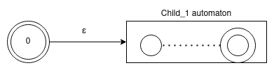

# Contents:
- [Basic Guide](#Basic-Guide)
    - [Introduction](##Introduction)
    - [Building a query](##Building-a-query)
    - [Paths returned](##Paths-returned)
    - [Getting the path](##Getting-the-path)
- [Advanced Guide](#Advanced-Guide)
    - [Automaton Builder Phase](##Automaton-Builder-Phase)
        - [Property Path Constructor](###Property-Path-Constructor)
        - [OpPath](###OpPath)
        - [Path Automaton](###Path-Automaton)
        - [Path Automaton Transformations](###Path-Automaton-Transformations)
    - [Finding Paths Phase](##Finding-Paths-Phase)
        - [Check operator](##Check-operator)
        - [Enum operator](##Enum-operator)
    - [Materialize Phase](##Materialize-Phase)


# Basic Guide

## Introduction

MilleniumDB models data as a directed-labeled-graph like [RDF](https://es.wikipedia.org/wiki/Resource_Description_Framework), thus you can make queries about paths between nodes. This guide is made so that you understand how to generate a query of this type.
## Building a query

First, you have to understand how is the structure of a property path query:

```
SELECT ...
MATCH <<here you have to describe path>>
....
```
Paths must be describe in __match__ clause. Now we will see how you have to describe a path. First is importante to define start and end node. You can _fix_ a specific node like `(Q1)`, groups of node like `(?x :type)` or not _fix_ the node `(?x)`. At least one node in the query must be _fixed_. Finally you have to join the nodes with a `=[<desc>]=>`. The query looks like:

```
// Correct
SELECT ...
MATCH (?x)=[<<path description>>]=>(Q1)
....

// Correct
SELECT ...
MATCH (?x :type)=[<<path description>>]=>(?y)

// Incorrect: Not fixed node

SELECT ...
MATCH (?x)=[<<path description>>]=>(?y)
```
Now you have to describe the path between this node, you write inside `[]` a `:` followed by a label of a path. You can relation many labels of path with the next operators

- `:P1 / : P2`: Sequence. `P1` and `P2` must be in the path.
- `:P1 | :P2`: Alternative. `P1` or (exclusive) `P2` must be in the path.
- `:P1*`: Kleene Start. Refers a path with 0 or more `:P1`. Always return at least one node
- `:P1?`: Optional: Refers a path with 0 or one `P1`
- `:P1+`: Refers to a path with one or more `P1`
- `^:P1`: Inverse operator.
- `:P1{a,b}`: Refers a path that `P1` appears more or equal than a times and less or equal that b times.

For a more detailed description, you can see [SPARQL](https://www.w3.org/TR/sparql11-query) sintax.

Finally you query looks like:

```
// Nodes ?y that can be reached with the path
// (Q1)-[:P1]->(?something)-[:P2]->(?y)
SELECT ...
 MATCH (Q1)=[:P1 / :P2]=>(?y)
 ...
```

You can do a sequence of paths, like:

```
// For each ?x1 founded, will find a path to
// ?x2 that matches with :P| :P4. After
// repeat this for each ?x2 founded, after ?x3, etc.
SELECT ...
 MATCH (Q1)=[:P1 / :P2]=>(?x1)=[:P3 | :P4]=>(?x2)=....=>(?xn)
 ...
 ```

You can apply a conjuntion of paths:


```
// Each ?x that will be returned must match will all
// paths
SELECT ...
 MATCH (Q1)=[:P1 / :P2]=>(?x),
       (Q1)=[:P3 | :P4]=>(?x),
       ....
       (Q1)=[....]=>(?x)
 ...
 ```


## Paths returned


As you can see, queries that defines a property path, return paths between a node or that start or reach to specifc node. But are all posible paths returned?

The answer is depends of operators that you use. For each node that the query founds a corresponding path will be returned, but is more than one path matches and reaches to the same node, only one of them will be returned. The main rule is: __a node never will be returned more than one time__.


```
SELECT *
MATCH (Q1)=[:P1 | :P2]=>(?x)
```
Suposes two paths: `Q1=[:P1]=>Q2` and `Q1=[:P2]=>Q2`, thus there are two paths, but return the both implies that `Q2` will be returned two times, then only one path will be returned (depends how are ordered in bd).

Now if your query is a sequence like:
```
SELECT *
MATCH (Q1)=[:P1 / :P2]=>(?x)
```
There is no way that exists to different paths to `Q2` with the same sequence, each path is unique, thus all paths possibles paths will be returned in this query, because there only one possible path that matches with this and reachs to `Q2`.

There is an important difference between  arrows `-[]->` and `=[]=>`. In this guide we have talked only about the last of them. You can specify a property path with both arrows, but the output and the execution will be different. See the following example:

Imagine that you have a bd like the following:
```
A->B :P1 prop:1
A->B :P1 prop:1
```
Then you have the following query:

 ```
 SELECT *
 MATCH (?x)=[:P1]=>(B)
 ```

This query asks about property paths, then as we can see the output does not repeat the same node in the output, then only one path will exists in the output, this makes sense because although the edges have a different value for `prop` attribute, they are the same property path.

 Now, if you do the following query:

 ```
 SELECT *
 MATCH (?x)-[:teammate]->(B)
 ```

In this query, you ask for edges, not a property path. Then in the output the two paths will be returned (That means that `A` nodes will be duplicated).

## Getting the path

In the query you can recover the path:

```
SELECT my_path (Q1)=[my_path? :P1 / :P2]=>(?x)
```

In the future, operators like ORDER_BY or GROUP_BY can be applied to the path.

-----------------
# Advanced Guide

The following guide is intended for someone who will be working on the MilleniumDB engine.


Property Paths queries are handled in `OpMatch`. First the querie is parsed to a OpPath class, that will be used to construct a finite automaton that represents the semantic of the querie. Finally, the automaton is passed to a binding_id_iter class that use the automaton to check if the path to a node matches with the path asked in the querie.

## Automaton Builder Phase

The objetive of this fase is generate an automaton that accepts the regular expression described in the query.
### Property Path Constructor

This module transforms a grammar object into a __OpPath__ subclass to allow use Op interface.

A query like:

`
SELECT (?x)
 MATCH (?x)=[:P1* | :P2]=>(?y)
`

Is transformend by the parser into a object like:

```C++
PropertyPathAlternative(
    PropertyPathBoundSuffix(atom="P1",suffix=ZERO_OR_MORE,inverse=false),
    PropertyPathBoundSuffix(atom="P2",suffix=NONE,inverse=false),
);
```

PathConstructor transforms this object into a object like:

```C++
OpPathAlternatives(
    OpPathKleeneStart(
        OpPath(atom="P1", inverse=false )
    ),
    OpPath(atom="P2", inverse=false)
);
```

PathConstructor uses a module called `DenullPath` to transforms queries with redundant Kleene Star:
```
SELECT (?x)
MATCH (?x)=[(:P1*)*]=>(?y)
```

Into queries without redundant kleene star operator

```
SELECT (?x)
MATCH (?x)=[(:P1*)]=>(?y)
```

The reduction works like a tree, where if a node is nullable it will be erased, children of this node will be connected with the parent.

A node is nullable if:
- `OpPathAtom`: Never nullable.
- `OpPathSequence`: Is nullable if all the sequence paths are nullables
- `OpPathAlternative`: Is nullable if at least one path if nullable.
- `OpPathKleeneStar`: Always is nullable.
- `OpPathOptional`: Always is nullable.

When a path is nullable, it will be replaced by it child. In the case of alternative, only nullable elements will be replaced.


### OpPath

Implements `Op` interface and some additional methods:

- `bool nullable()`: Return __true__ if it path is nullable.

- `string to_string()`: Returns a string representations of OpPath.
- `unique_ptr<OpPath> duplicate()`: Returns a pointer to a copy of this path.
- `OpPathType type()`: Returns a the type of op path. Types are described [later](####OpPath-Types).
- `void invert()`: Recursively inverts each path.
- `PathAutomaton get_automaton()`: Returns a non deterministic automaton with epsilon transitions  that describe the path. Automaton construction is described in [Path Automaton section](###Path-Automaton).
- `PathAutomaton get_transformed_automaton()`: Return a automaton without epsilon transitions.

The OpPath has the following types:

- OpPathAlternatives: Used for `|` operator. Have a vector of OpPaths that represents the alternatives.
- OpPathSequence: Used for `/` operator. Have a vector of OpPaths that represents the sequence.
- OpPathKleeneStar: Used for `*` operator. Have a OpPath attribute to represent the child.
- OpPathOptional: Used for `?` operator. Have a OpPath attribute to represent the child.
- OpPathAtom: Represents to `:P1`. Have a string atom to represent `P1`.

The `:P1+` is transformed to `:P1 / :P1*` which is equivalent. The `:P1{a,b}` is transformed to `:P1 / ... {a times} / :P1 / :P1? ... {b - a times} / :P1?. `


### Path Automaton

PathAutomaton class is used to represent an automaton that accepts the language described in a query.


Each OpPath implements a `get_automaton` that returns a PathAutomaton class. The method will return a automaton as follow:

- `OpPathAtom`:

    

- `OpPathAlternatives`:
Gets automatons for each OpPath in alternatives. After join it as follows:

   


- `OpPathSequence`: Get childs automaton from sequence vector and join them as follows:

    

- `OpPathKleeneStar`:

    

- `OpPathOptional`:

    

The automaton final automaton is obtained by `OpPath::get_transformed_automaton()`. The `Op` are handled by plan builders, `OpPath` are handled in `PropertyPathPlan`, then automaton is obtained and passed to `Binding_id_iter` operator.

-------------------------------


Let's see how the automaton for the query `(:A / :B)*` will be constructed.

1. First, OpPathAtoms will be constructed separately:


2. Parent of A and B automaton is a OpPathSequence. This generates a new automaton:


3. According with the OpPathSequence automaton schema. `A` and `B` automatons will be concatenated inside the sequence automaton and linked with epsilon transitions:


### Path Automaton Transformations

After generate the automaton, there are 4 steps to transforms it automaton into a automaton without epsilon transitions:

1. __Mergeable states__

A state `s` is mergeable with `v` in the following cases:
- Has only one transition that starts from `s`, and the transitions is epsilon and reach to `v`.
- Exists only one transitions that reaches to s and starts from `v`.


This reduce the number of states of the automaton.

2. __Replace epsilon transitions__

This step is no always a optimization, because can increase the number of connections, but delete all epsilon transitions.

For all state `s`, its epsilon closure is obtained (All the states that only can be reached by epsilon transitions from s).

For each `v` in the epsilon closure, if `v` connect with w by a non-epsilon transition, then `s` will be connected with `w` by the same transition, and delete the old transition between `v` and `w`.


3. __Delete unreachable states from start__

Delete all states that cannot be reached from start node. In the last example, v will be erased.

3. __Transform to one final state__

If exists more than one end state. Add and additional state and redirect all states that reaches to end state to this state.


4. __Delete not final state connected nodes__

As you can se, in the last step, the old end state will no connected to final state. In this steps this nodes will be erased.


## Path finding phase

Exists a class called `SearchState` that is used by all path finding algorithms of MilleniumDB to save found nodes.

A `SearchState` saves an automaton state (`state`), the ObjectId of the db node that represents (`object_id`), a `SearchState` pointer to previous node that connects (`previous`), the direction (`direction`) and the label (`label_id`) of this connection. Also exists a hash for this class, but the most important thing is that two `SearchState` instances will have the same hash if has the same `state` and `object_id` attributes.


### Check operator

Find only one path between two nodes. Its usage is more related to know if a specific path exists between some nodes.
`
SELECT ?p
 MATCH (Q1)=[?p :P1]=>(Q2)
`
If exists a path, as you can see, ?p is the same that you describe in the query. You can do a check between a sets of nodes:

`
SELECT ?p
 MATCH (?x :type_x)=[?p :P1]=>(?y :type_y)
`

For each node of type_x, MilleniumDB will check if exists a path of P1 label with each node of type_y.

Check operator is implemented with BFS classic algorithm, uses a unordered set of `SearchState` to
check if a state already has been visited.

To have a result as fast as possible, BFS before to push a state to `open`, checks if final and return if it is the case (A slower option is to make the check when a state is pulled out from open).


### Enum operator
Enumerates the nodes that can be reached or reach to specific node or set of node. As example:

`
SELECT ?x
 MATCH (?x)=[?p :P1]=>(Q2)
`


`
SELECT ?x
 MATCH (Q1)=[?p :P1]=>(?x)
`

`
SELECT ?x, ?y
 MATCH (?x :type_x)=[?p :P1]=>(?y)
`

There are four implementations for Enum operator. The four implementations works as the same way. They implement a `next` method where a path finder algorithm is executed until find a state to be returned (returns true), or explore all the feasible nodes and returns false.

The only difference is the path finder algorithms that each one implements:

- BFS Simple: A basic implementation of BFS to enumerates all the nodes. You can use it to familiarize yourself with the code.

- BFS Iter: Is the operator that actually Millenium DB uses in Release model. Is a more complex implementation of BFS. When expands a state, it saves a class attribute called `iter` that generates the children of current state calling `iter.next()`. Iter attribute allow to reduce open memory usage, because current state's children will not added simultaneously to open, they will be generated by iter avoiding to add all at the same time in open.
BFS Iter has better performance (in general) that other algorithms when the output is big, but has similary performance if the output is smaller.

- AStar Iter: AStar implementation. Uses an Iter, but each node has his itself iter. Has a better perfomance with smaller outputs. The main problem of current implementation is the steps used to modify elelements of the open (Implemented as a heap).
- DFS Iter: Implements DFS with iter, similar to AStar. The main problem with this algorithm is that the paths that it founds are not optimal, in some cases longer paths can affect the answer time due to time used to construct it.

A node __will be return only one time__, the reason of thisis that all algorithms when visit a node, insert it into a set that is used to check if the node has been visited before add it to open. Thus each node will only visited and returned one time, that is the reason why engine does not return all possible path between two nodes (The solution of this is a exponential solution).

## Materialize Phase

TODO: