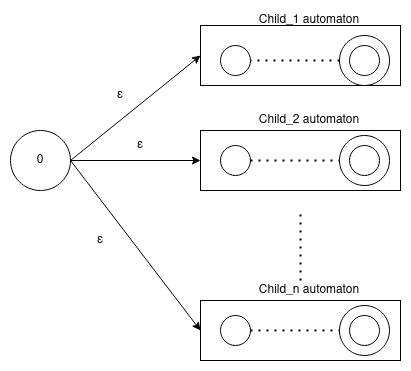
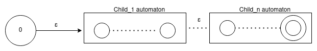

# Contents:
1. [Property Paths Queries](#Property-Paths-Queries)
     [Introduction](##Introduction)
    - [Building a query](##Building-a-query)
    - [Paths returned](##Paths-returned)
    - [Getting the path](##Getting-the-path)
2. [Advanced](#Advanced)
    - [Parsing Phase](##Parsing-Phase)
        - [Property Path Constructor](###Property-Path-Constructor)
        - [OpPath](###OpPath)
        - [Path Automaton](###Path-Automaton)


# Property Paths Queries
## Introduction

Property paths queries refers to path between to nodes
or all the paths that start from or reach to specific node. In the query, you have to use a regular expresion to describe de desired path:

`
SELECT *
 MATCH (Q1)=[:P1 / :P2]=>(?y)
`

## Building a query

There are 7 basic expresions to build a regular expresion that describes a path:

- `:P1 / : P2`: Sequence. `P1` and `P2` must be in the path.
- `:P1 | :P2`: Alternative. `P1` or (exclusive) `P2` must be in the path.
- `:P1*`: Kleene Start. Refers a path with 0 or more `:P1`. Always return at least one node
- `:P1?`: Optional: Refers a path with 0 or one `P1`
- `:P1+`: Refers to a path with one or more `P1`
- `^:P1`: Inverse operator.
- `:P1{a,b}`: Refers a path that `P1` appears more or equal than a times and less or equal that b times.

You have to fix (or define) a node of start or end:

`
SELECT *
 MATCH (?x)=[:P1 / :P2]=>(?y)  // Fails, a start and end node is not defined
`

`
SELECT *
 MATCH (Q1)=[:P1 / :P2]=>(?y)  // Correct, start is fixed
`

`
SELECT *
 MATCH (?x)=[:P1 / :P2]=>(Q1)  // Correct, end is fixed
`

`
SELECT *
 MATCH (?x :label_node)=[:P1 / :P2]=>(?y)  // Correct, start is fixed
`

## Paths returned

TODO: Explain relation with RDF.
As you can see, queries that defines a property path, return paths between a node or that start or reach to specifc node. But are all posible paths returned?

The answer is depend of the operator that you use. Imagine you have the following graph as database (aux node is not relevant for the example):

```
(Q1)=[:P1]=>(aux)=>[:P2]=>(Q2)
(Q1)=[:P1]=>(aux)=>[:P2]=>(Q3)
(Q1)=[:P3]=>(aux)=>[:P3]=>(aux)=>[:P3]=>(aux)=>[:P3]=>(aux)=>[:P4]=>(Q2)
```

You can do the following query:

`
SELECT *
MATCH (Q1)=[:P1 / :P2]=>(?x)
`

The two first paths will be returned, in this case __all__ the paths will be founded. Now, a example with a Kleene Star operator

`
SELECT * MATCH (Q1)=[:P3* / :P4]=>(?x)
`

You can think that third path will be returned. Kleene Star operator allows that P3 appears many times in a path. But the path finding do not work like this. If you want the third path, you have to make a query like:


`
SELECT * MATCH (Q1)=[:P3* / :P3* / :P3* /:P3* / :P4]=>(?x)
`
`
SELECT * MATCH (Q1)=[:P3{3,4} / :P4]=>(?x)
`

## Getting the path

In the query you can recover the path:

`
SELECT my_path (Q1)=[my_path? :P1 / :P2]=>(?x)
`

# Advanced

The following guide is intended for someone who will be working on the MilleniumDB engine.


Property Paths queries are handled in `OpMatch`. First the querie is parsed to a OpPath class, that will be used to construct a finite automaton that represents the semantic of the querie. Finally, the automaton is passed to a binding_id_iter class that use the automaton to check if the path to a node matches with the path asked in the querie.

## Parsing Phase

The objetive of this fase is generate an automaton that accepts the regular expression described in the query.
### Property Path Constructor

The objetive of this module is transform a grammar object into a __OpPath__ subclass to allow use Op interface.

A query like:

`
SELECT (?x)
 MATCH (?x)=[:P1* | :P2]=>(?y)
`

Is transformend by the parser into a object like:

```C++
PropertyPathAlternative(
    PropertyPathBoundSuffix(atom="P1",suffix=ZERO_OR_MORE,inverse=false),
    PropertyPathBoundSuffix(atom="P2",suffix=NONE,inverse=false),
);
```

PathConstructor transform this object into a object like:

```C
OpPathAlternatives(
    OpPathKleeneStart(
        OpPath(atom="P1", inverse=false )
    ),
    OpPath(atom="P2", inverse=false)
);
```

PathConstructor uses a module called `DenullPath` to transforms queries with redundant Kleene Star:
```
SELECT (?x)
MATCH (?x)=[(:P1*)*]=>(?y)
```

Into queries without redundant kleene star operator

```
SELECT (?x)
MATCH (?x)=[(:P1*)]=>(?y)
```

The reduction works like a tree, where if a node is nullable it will be erased, children of this node will be connected with the parent.

A node is nullable if:
- `OpPathAtom`: Never nullable.
- `OpPathSequence`: Is nullable if all the sequence paths are nullables
- `OpPathAlternative`: Is nullable if at least one path if nullable.
- `OpPathKleeneStar`: Always is nullable.
- `OpPathOptional`: Always is nullable.

When a path is nullable, it will be replace by it child. In the case of alternative, only nullable elements will be replaced.


### OpPath

Implements `Op` interface. Implements some important additional methods:

- `bool nullable()`: Return __true__ if it path is nullable. Nullable paths are discused in [optimization section](#Optimizations).

- `string to_string()`: Returns a string representations of OpPath.
- `unique_ptr<OpPath> duplicate()`: Returns a pointer to a copy of this path.
- `OpPathType type()`: Returns a the type of op path. Types are described [later](###OpPath-Types).
- `void invert()`: Recursively inverts each path.
- `PathAutomaton get_automaton()`: Returns a non deterministic automaton with epsilon transitions  that describe the path. Automaton construction is described in [Path Automaton section](##Path-Automaton).
- - `PathAutomaton get_transformed_automaton()`: Return a automaton without epsilon transitions.

#### OpPath Types

- OpPathAlternatives: Used for `|` operator. Have a vector of OpPaths that represents the alternatives.
- OpPathSequence: Used for `/` operator. Have a vector of OpPaths that represents the sequence.
- OpPathKleeneStar: Used for `*` operator. Have a OpPath attribute to represent the child.
- OpPathOptional: Used for `?` operator. Have a OpPath attribute to represent the child.
- OpPathAtom: Represents to `:P1`. Have a string atom to represent `P1`.

The `:P1+` is transformed to `:P1 / :P1*` which is equivalent. The `:P1{a,b}` is transformed to `:P1 / ... {a times} / :P1 / :P1? ... {b - a times} / :P1?. `


### Path Automaton

PathAutomaton class is used to represent the semantic of a property path querie.
The main attributes of this class are
    - `vector<vector<TransitionsId>> from_to_connections`: The i element of this vector, describe the connections that starts from i state. A TransitionId object have `to` attribute (the automaton state where this transition reachs), `label` with a ObjectId that represents a label of a path.
    - `uint32_t final_state`: The id of the final_state of the automaton.
    - `bool start_is_final`: True if the first state is final.


Each OpPath implements a `get_automaton` that returns a PathAutomaton.. The method will return a automaton as follow:

- `OpPathAtom`:

    

- `OpPathAlternatives`:
Gets automatons for each OpPath in alternatives. After join it as follows:

   


- `OpPathSequence`: Get childs automaton from sequence vector and join them as follows:

    

- `OpPathKleeneStar`:

    

- `OpPathOptional`:

    


-------------------------------
The next method allow to join two automatas:

- `rename_and_merge(PathAutomaton& other)`:
    Add `other` connections to the current automaton. But all states of other will be rename like `n + state_id`, where `n` is the number of states of the current automaton and `state_id` the id of a state in `other`. Also renames the `other`'s end states and start states.

Let's see how the automaton for the query `(:A / :B)*` will be constructed.

First, OpPathAtoms will be constructed separately:


Parent of A and B automaton is a OpPathSequence. This generates a new automaton:


According with the OpPathSequence automaton schema. `A` and `B` automatons will be concatenated inside the sequence automaton and linked with epsilon transitions:


#### Path Automaton Transformations

Path Automaton have 4 transformations:

#### Mergeable states

A state `s` is mergeable with `v` in the following cases:
- Has only one transition that starts from `s`, and the transitions is epsilon and reach to `v`.
- Exists only one transitions that reaches to s and starts from `v`.


This reduce the number of states of the automaton.

#### Replace epsilon transitions

This step is no always a optimization, because can increase the number of connections, but delete all epsilon transitions.

For all state `s`, its epsilon closure is obtained (All the states that only can be reached by epsilon transitions from s).

For each `v` in the epsilon closure, if `v` connect with w by a non-epsilon transition, then `s` will be connected with `w` by the same transition, and delete the old transition between `v` and `w`.


### Delete unreachable states from start

Delete all states that cannot be reached from start node. In the last example, v will be erased.


### Transform to one final state

Delete all states that cannot reachs to end.