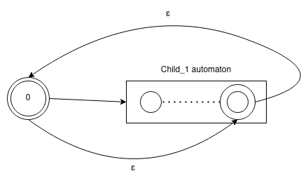

# Contents:
- [Property Paths](#Property-Paths)
- [Classes](#Classes)
    - [Property Path Constructor](##Property-Path-Constructor)
    - [OpPath](##OpPath)
    - [Path Automaton](##Path-Automaton)
- [Optimizations](#Optimizations)
    - [Path Constructor Optimization](##Path-Constructor-Optimization)
    - [Path Automaton Optimizations](##Path-Automaton-Optimizations)


# Property Paths

Property paths queries are like:

`
SELECT (?x)
 MATCH (?x)=[:P1 / :P2]=>(?y)
`

There are 7 operators defined:

- `:P1 / : P2`: Sequence. `P1` and `P2` must be in the path.
- `:P1 | :P2`: Alternative. `P1` or (exclusive) `P2` must be in the path.
- `:P1*`: Kleene Start. Refers a path with 0 or more `:P1`.
- `:P1?`: Optional: Refers a path with 0 or one `P1`
- `:P1+`: Refers to a path with one or more `P1`
- `^:P1`: Inverse operator.
- `:P1{a,b}`: Refers a path that `P1` appears more or equal than a times and less or equal that b times.


Property Paths queries are handled in `OpMatch`. But exists a big difference with other kind of queries that links directly a __BindingIdIterator__ or __BindingIterator__ in its own Op operator. Property Paths queries needs a middle a step that is generate a representation of the querie semantic that can select which path is correct according to the semantic.

The representation selected to this, is a Non Determinist Automaton of Finite States with Epsilon Transitions.

# Classes
## Property Path Constructor

Ubicated at `src/base/parser/logical_plan/path_constructor/`


The objetive of this module is transform a grammar object into a __OpPath__ subclass to allow use Op interface.

A query like:

`
SELECT (?x)
 MATCH (?x)=[:P1* | :P2]=>(?y)
`

Is transformend by the parser into a object like:

```C++
PropertyPathAlternative(
    PropertyPathBoundSuffix(atom="P1",suffix=ZERO_OR_MORE,inverse=false),
    PropertyPathBoundSuffix(atom="P2",suffix=NONE,inverse=false),
);
```

Path Constructor transform this object into a object like:

```C
OpPathAlternatives(
    OpPathKleeneStart(
        OpPath(atom="P1", inverse=false )
    ),
    OpPath(atom="P2", inverse=false)
);
```

## OpPath
Ubicated in `src/base/parser/logical_plan/op/op_path.h`

Uses `Op` interface, but add more methods:

- `bool nullable()`: Return __true__ if it path is nullable. Nullable paths are discused in [optimization section](#Optimizations).

- `string to_string()`: Returns a string representations of path.
- `unique_ptr<OpPath> duplicate()`: Returns a pointer to a copy of this path.
- `OpPathType type()`: Returns a the type of op path. Types are described [later](###OpPath-Types).
- `void invert()`: Recursively inverts each path as described in this [section](###Invert).
- `PathAutomaton get_automaton()`: Returns a non deterministic automaton with epsilon transitions  that describe the path. Automaton construction is described in [Path Automaton section](##Path-Automaton).
- `PathAutomaton get_optimized_automaton()`:
Returns a optmized automaton. Automaton construction is described in [Path Automaton optmization section](##Path-Automaton-Optimizations).


### OpPath Types

- OpPathAlternatives: Used for `|` operator. Have a vector of OpPaths that represents the alternatives.
- OpPathSequence: Used for `/` operator. Have a vector of OpPaths that represents the sequence.
- OpPathKleeneStar: Used for `*` operator. Have a OpPath attribute to represent the child.
- OpPathOptional: Used for `?` operator. Have a OpPath attribute to represent the child.
- OpPathAtom: Represents to `:P1`. Have a string atom to represent `P1`.

The `:P1+` is transformed to `:P1 / :P1*` which is equivalent. The `:P1{a,b}` is transformed to `:P1 / ... {a times} / :P1 / :P1? ... {b - a times} / :P1?. `

### Invert

UNCOMPLETED

## Path Automaton


PathAutomaton class have two important vectors:
    - `vector<vector<Transitions>> from_to_connections`: The i element of this vector, describe the connections that starts from i state.
    - `vector<vector<Transitions>> to_from_connections`: The i element of this vector describe the connections that reach to i state.

Each OpPath implements a `get_automaton` method and in each case, the method will return a automaton as follow:

- `OpPathAtom`:

    

- `OpPathAlternatives`:


   


- `OpPathSequence`:

    

- `OpPathKleeneStar`:

    

- `OpPathOptional`:

    


-------------------------------
The final automaton is obtained by forming a construction tree, where the leafs will be OpPathAtom automatons. Then the automata will be mixed according to the type of OpPath that is their parent.

The mix process is handled by `rename_and_merge` method

- `rename_and_merge(PathAutomaton& other)`:
    Add `other` connections to the current automaton. But all states of other will be rename like `n + state_id`, where `n` is the number of states of the current automaton and `state_id` the id of a state in `other`. Also renames the `other`'s end states and start states.

Let's see how the automaton for the query `(:A / :B)*` will be constructed.

First, OpPathAtoms will be constructed separately:


Parent of A and B automaton is a OpPathSequence. This generates a new automaton:


According with the OpPathSequence automaton schema. `A` and `B` automatons will be concatenated inside the sequence automaton and linked with epsilon transitions:


The final automaton is not a minimal automaton. In [optimization section](##Path-Automaton-Optimizations) you can see how this epsilon transitions of this automaton will be removed and some techniques to reduce the size of it.


# Optimizations
## - Path Constructor Optimization

Path Constructor uses a module called `SimplifyPropertyPath` ubicated at `src/base/parser/logical_plan/op/visitors/simplify_property_path.h`.

This module allows to path constructor reduce queries like:

```
SELECT (?x)
MATCH (?x)=[(:P1*)*]=>(?y)
```

To queries without redundant kleene star operator

```
SELECT (?x)
MATCH (?x)=[(:P1*)]=>(?y)
```

The reduction works like a tree, where if a node is nullable it will be erased, children of this node will be connected with the parent.

A node is nullable if:
- `OpPathAtom`: Never nullable.
- `OpPathSequence`: Is nullable if all the sequence paths are nullables
- `OpPathAlternative`: Is nullable if at least one path if nullable.
- `OpPathKleeneStar`: Always is nullable.
- `OpPathOptional`: Always is nullable.

When a path is nullable, it will be replace by it child. In the case of alternative, only nullable elements will be replaced.

## Path Automaton Optimizations

Path Automaton have 4 optimizations:

### Mergeable states

A state s is mergeable with v if:
- Has only one transition that starts from s, and the transitions is epsilon and reach to v.
- Exists only one transitions that reaches to s and starts from v.


### Replace epsilon transitions

This step is no always a optimization, because can increase the number of connections, but delete all epsilon transitions.

For all state s, get the epsilon closure (All the states that only can be reached by epsilon transitions from s). By definition, s must be in itself epsilon closure, but forcing include it doesn't make change in the algorith, so s may not belong to itself epsilon closure.

For each v in the epsilon closure, if v connect with w by a non-epsilon transition, then s will be connected with w by the same transition, and delete the old transition between v and w.

Example:

```
        s-[]->v-[P1]->w
```
Transform into
```
        s-[P1]->w v
```

## Delete unreachable states from start

Delete states that cannot be reached from start node. In the last example, v will be erased.

## Delete unreachable states from end

Unreachable states from end can be called absortion states, because there no way to get back of them by a valid transition. Delete this states doesn't change the semantic of automaton.