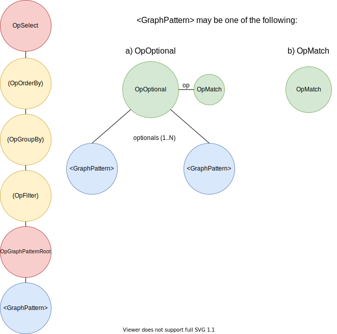
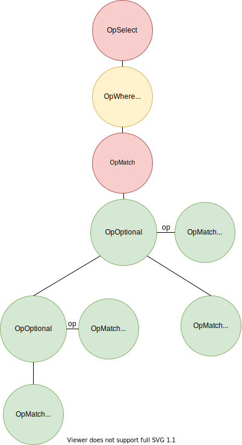
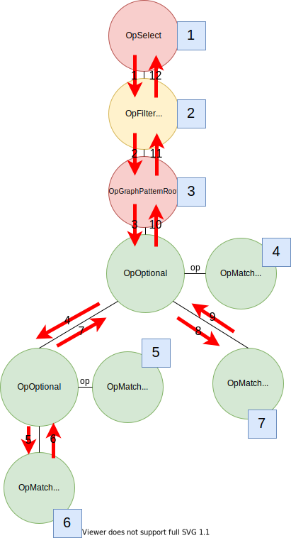
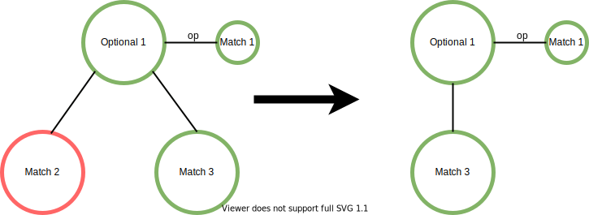
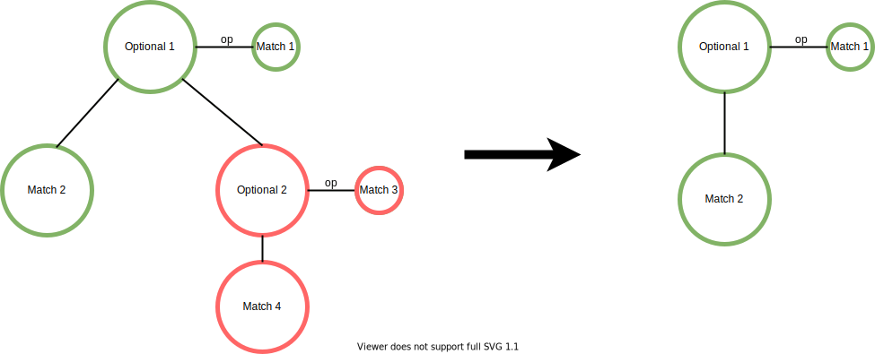
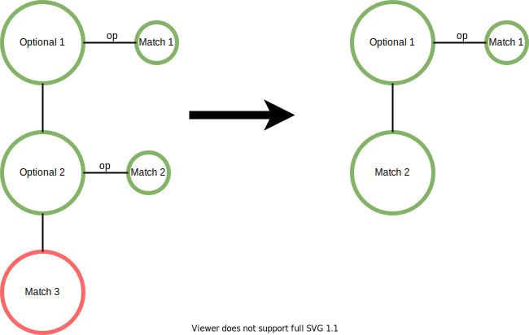
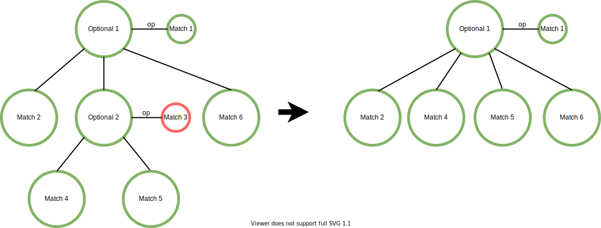

# Query Execution

# Table of contents

1. [Parsing](#parsing)
2. [Logical Plan](#logical-plan)
* 2.1. [Op Interface](#op-interface)
* 2.2. [Visitor Interface](#visitor-interface)
* 2.3. [Generated logical plans](#generated-logical-plans)
3. [Physical Plan](#physical-plan)
* 3.1. [Binding Iter Interface](#binding-iter-interface)
  * 3.1.1. [Graph Object](#graph-object)
* 3.2. [Binding Id Iter Interface](#binding-id-iter-interface)
* 3.3. [Generation](#physical-plan-generation)
    * 3.3.1. [Binding Iter Visitor](#binding-iter-visitor)
    * 3.3.2. [Binding Id Iter Visitor](#binding-id-iter-visitor)
4. [Examples](#examples)
* 4.1. [Queries](#query-examples)
  * 4.1.1. [Basic query](#basic-query)
  * 4.1.2. [Complex query](#complex-query)
* 4.2. [Logical plan optimizations](#logical-plan-optimization-examples)


# 1. Parsing<a id="parsing"></a>

The first step of any query execution is the parsing of the text. This text must comply with the current grammar established. If it meets the requirements, an Abstract Syntax Tree (AST) is generated, which is later used to create the logical plan. This grammar is described in TODO: Add grammar documentation.

# 2. Logical Plan<a id="logical-plan"></a>

The logical plan is created based on the AST by recursively accessing each node of the AST and generating the equivalent logical plan, based on the **Op** interface. Each node (or specific combination of nodes) will be converted into a member of a class that inherits from the Op class. After being generated, the physical plan is created by visiting each one of these nodes, by using a **visitor** interface.

## 2.1. Op Interface<a id="op-interface"></a>

Any member that inherits from the Op class must have a constructor which will assign the necessary variables of the member (and possible children). It must also have the following methods:

- `accept_visitor(OpVisitor& visitor)`: Method that connects the Op interface with the Visitor interface. In most cases it wil execute `visitor.visit(*this);` and the `visit` method from the Visitor interface will be in charge of describing how to visit each node.
- `get_vars(set<Var>&)`: Method that gets adds to the set all the variable names involved in this specific node. Useful for making simplifications of the logical plan and generating the physical plan.
- `print_to_ostream()`: Method that displays the Op generated and their possible children. It is useful for debugging purposes.

The following list shows the current classes that inherit from Op:

- `OpLabel`: Used to define labeled nodes, with the attributes `node_name` and `label`.

  For example, in `(?x :Person)`, `node_name` is `?x` and `label` is `Person`.
- `OpProperty`: Used to define properties of nodes or edges, with the attributes `obj_name`, `key`, `value`.
  For example, in `(?x {age: 15})`, `obj_name` is `?x`, `key` is `age` and `value` is `15`. Values may be numbers, booleans, strings or `null`.
- `OpConnection`: Used to define connections with the attributes `from`, `to`, `type`.

  For example: `(?x)->(?y)`. In this case, `from` is `?x`, `to` is `?y` and `type` is the variable that was assigned to the annonymous edge (possibly `?_e0:type`).
- `OpConnectionType`: Used to define connection types, having the attributes `edge` and `type`.

  For example, `(?x)-[:knows]->(?y)` could have the edge `?_e0` and type `knows`.
- `OpUnjointObject`: Used when a match clause specifies variable as a node without any other information. It stores the variable in `obj_name`

  For example, `SELECT (?x) MATCH (?x)` will use the `OpUnjointObject` Op, and its `obj_name` is `?x`.
- `OpMatch`: Used to describe any Graph Pattern that do not contain OPTIONAL clauses. In order to describe any Graph Pattern, it has the following attributes: `labels` (set of `OpLabel`), properties (set of `OpProperty`), connections (set of `OpConnection`), property_paths, connection_types (set of `OpConnectionType`), unjoint_objects (set of `OpUnjointObject`). It is important to note that in the Graph Patterns that do not use OPTIONAL clause, the order of the join operations do not matter and that is the reason why sets are being used instead of lists. The results of `OpMatch` will be pipelined into its parent.

  For example, a possible pattern that uses `OpMatch` could be:
  `(?x :Person {age: 20})-[:follows]->(?y :Person {age: 20}), (?y)-[:follows]->(?y)`.

- `OpOptional`: Used to describe any Graph Pattern that contain OPTIONAL clauses. In order to describe any Graph Pattern, it has the following attributes: `op` (The main pattern) and `optionals`, a list of Graph Patterns (which can either be `OpMatch` or `OpOptional`). The results of `OpOptional` will be pipelined to its parent (possibly an `OpOptional` or `OpGraphPatternRoot`).

  For example, a possible pattern that uses `OpOptional` could be:
  `(?x)-[:follows]->(?y) OPTIONAL {(?y)-[:follows]->(?x)}`.
- `OpGraphPatternRoot`: Contains the main Graph Pattern (in its `op` attribute) which can be either an `OpMatch` or `OpOptional`. This pattern will always have as `op` either the `OpMatch` or `OpOptional` that comes after the SELECT clause. It pipelines its results to its parent.

- `OpFilter`: Used to filter results by a criteria. Used with the WHERE clause, and has `op` as attribute, which is the op where the results will be pipelined from, and `formula` which will filter said results.
  For Example,`SELECT (?x) MATCH (?x) WHERE ?x.age > 20`.
- `OpGroupBy`: Used to group pipelined results by a certain variable.
  For example, TODO: add example when it is working.
- `OpOrderBy`: Used to order pipelined results by a certain variable.
  For example, `SELECT (?x) MATCH (?x) ORDER BY ?x.age`
- `OpSelect`: Used to select the desired results. It is the root node of every logical plan.

## 2.2. Visitor interface<a id="visitor-interface"></a>

The visitor interface allows each node of a plan to be visited in a specific order. Each visitor must have a visit method for each of the classes that inherit from Op. Some methods may be empty.

There are two main groups of visitors: The first one (group 1) are used to check properties and make simplifications of the logical plan. This visitors are the following:

- `CheckVarNames`: Checks that the variable names follow the semantics of MilleniumDB.
- `CheckWellDesigned`: Check that the query is well designed. Currently, MilleniumDB only supports well designed queries. To check wether a query is well designed or not, it is necessary for each of the variables involved in the main Graph Pattern to form a connected graph between the nodes. Any query without the OPTIONAL clause is well designed.

  An example of a well-designed query is the following:
  ```
  SELECT ?x, ?y, ?z, ?u
  MATCH (?x)-[:knows]->(?y)
  OPTIONAL {(?y)-[:knows]->(?z)}
  OPTIONAL {(?y)-[:follows]->(?u)}
  ```
  Where we can see that every node (Optional or Match) that uses `?x` is connected, every node that uses `?y` is connected, every node that uses `?z` is connected and every node that uses `?u` is connected.

  An example of a non-well designed query is the following:
  ```
  SELECT ?x, ?y, ?z, ?u
  MATCH (?x)-[:knows]->(?y)
  OPTIONAL {(?y)-[:knows]->(?z)}
  OPTIONAL {(?z)-[:follows]->(?u)}
  ```
  `?z` is present in both Optional children, but not in its parent main pattern.

- `FormulaCheckVarNames`: Check that the variable names used in statements and formulas (e.g. `WHERE` or `SELECT` clause) follow the semantics of MilleniumDB.
- `FormulaToCondition`: Transforms a given formula to a condition.
- `OptimizeTree`: Simplifies the logical plan generated based on certain properties of the logical plan. This simplifications only happen if the query has an `OPTIONAL` clause. The simplifications are done by executing a DFS algorithm over the Optional Nodes, going through their children in order and saving the variables involved in each node. Since the query is well defined, once a variable is assigned it must not be assigned once again, so any node that does not assign any new variables is marked as useless and is eliminated. On section 4, examples, tree optimizations will be shown, describing the algorithm in more detail.

The second group of visitors work over the **physical plan** and will be described in greater detail in section 3.3.1. and 3.3.2.

## 2.3. Generated logical plans<a id="generated-logical-plans"></a>

Currently, logical plans always follow the next structure. Yellow represents Ops that may or may not be present in the plan. Red are the Ops that will always be present in the plan. Blue is an Op that may follow one of two possible combinations, which will be shown after the diagram:



For simplification purposes, `OpMatch` nodes are not expanded. Examples will be shown in section 4.

# 3. Physical plan<a id="physical-plan"></a>

The physical plan of the query is generated by executing the logical plan starting from the root and using the visitor interface based on the second group of visitors described in section 2.2. First, it is necessary to explain the **BindingIter** interface and **BindingIdIter** interface.

## 3.1. Binding Iter Interface <a id="binding-iter-interface"></a>

The `BindingIter` abstract class functions as an iterator over bindings. Any class that inherits from `BindingIter` must have the following methods:
- `get_binding()`: returns the position where the results will be written.
- `next()`: returns true if there are more bindings and false otherwise.
- `analyze()`: prints the execution statistics.

This class connects the assigned variables with the actual values. It is more costly to use than `BindingIdIter` interface, so if possible use `BindingIdIter` interface. The values are represented with Graph Objects.

The following classes inherit from `BindingIter`:
- `GroupBy`: Groups results based on a criteria.
- `Match`: Iterates over the results.
- `OrderBy`: Orders results based on a criteria.
- `Select`: Selects the results until there are no more or until a numeric limit was reached.
- `Where`: Filters the results based on an evaluation of a condition.

### 3.1.1. Graph Object <a id="graph-object"></a>

Graph Objects are used to represent different types of values and their corresponding logic (such as `<`, `>`, `=` operators).

It can have the following variants:

- `NullGraphObject`: Represents the `null` object.
- `NotFoundObject`: Represents an object that was not found.
- `IdentifiableInlined`: Represents nodes that can be up to 8 bytes.
- `IdentifiableExternal`: Represents nodes that are longer than 8 bytes.
- `Edge`: Representes edges.
- `AnonymousNode`: Represents anonymous nodes.
- `bool`: Represents booleans.
- `StringInlined`: Represent strings that can are up to 8 bytes (including string end).
- `StringExternal`: Represents strings that are longer than 8 bytes.
- `int64_t`: Represents integers.

## 3.2. Binding Id Iter Interface<a id="binding-id-iter-interface"></a>

This interface is used to iterate over the binding ids that are specific to a certain operation (e.g. Joins and Table Lookups). This iteration works by assigning the relevant binding ids in a specific address. It is faster to use than `BindingIter` interface.

Any class that inherits from the BindingIdIter must implement the following methods:
- `begin(BindingId& parent_binding, bool parent_has_next)`: sets the starting position of the binding_ids to iterate over, and sets any relevant variable for the execution of the next methods.
`parent_binding` is the address where the bindings will be written, and `parent_has_next` is used to see if current parent has a next binding or not (mainly used for Joins).
- `next()`: This method must return if the iterator has a next element or not (boolean), and it must also write into `parent_binding` the current binding. If the member of the class is recursive, it must be ensured that the leafs write into `parent_binding`.
- `reset()`: resets the iterator to the first position.
- `assign_nulls()`: Assign the variables that are relevant to the current member of the class to `null`.
- `analyze(int indent)`: Shows the relevant information of the current BindingIdIter and displays its children (if any). Used to show the logical plan executed and is very useful for debugging purposes.

The following classes inherit from BindingIdIter:

- `EdgeTableLookup`: Looks up the Edge Table based on the available information and creates its corresponidng iterator. Its main attributes are `from`, `to`, `type`, `edge`.
- `IndexLeftOuterJoin`: Creates an iterator between two other iterators through the Index Left Outer Join algorithm.
- `IndexNestedLoopJoin`: Creates an iterator between two other iterators through the Index Nested Loop Join algorithm.
- `IndexScan`: Creates an iterator that accesses B+ Tree searching for elements that correspond to leaf patterns (labels, connections, properties).
- `NodeTableEnum`: Creates an iterator that goes through the node table, enumerating the results.
- `ObjectEnum`: Creates an iterator that iterates until a limit is reached.
- `OptionalNode`: Creates an iterator that involves its main pattern iterator and its child patterns' iterators, joining them in order through the Index Left Outer Join algorithm.
TODO: Add property path enum and check.
- `Union`: Creates an iterator over a list of iterators (`iters`) and consumes each iterator of the list in order. It does not filter duplicates.

## 3.3. Generation<a id="physical-plan-generation"></a>

The physical is generated by using the following two visitors. Optimizations are made so that `BindingIdIter` interface is used as much as possible before using `BindingIter` interface.

### 3.3.1. BindingIterVisitor<a id="binding-iter-visitor"></a>

This visitor is part of the second group of visitors that are used over the physical plan. Its main responsibilities is setting variables so that `BindingIdIterVisitor` works, and filtering / ordering / iterating over the bindings corresponding to their binding ids obtained from `BindingIdIterVisitor`. The objective of this visitor is to transform an Op tree (logical plan) to an corresponding BindingIter Tree (physical plan). It visits the following Ops:

- `visit(OpSelect)`: Creates the iterator to select the bindings.
- `visit(OpFilter)`: Creates the iterator to filter the bindings.
- `visit(OpOrderBy)`: Creates the iterator to order the bindings.
- `visit(OpGroupBy)`: Creates the iterator to group the bindings.
- `visit(OpGraphPatternRoot)`: creates the BindingIdIterVisitor so that it can later create the iterator that iterates over the relevant results of the query. Since its task is much more complex, the best choice was to separate the two interfaces (this visitor and the next one).

### 3.3.2. BindingIdIterVisitor<a id="binding-id-iter-visitor"></a>

This visitor is used inside the BindingIterVisitor when OpGraphPatternRoot is visited. Its main responsibilities is creating the physical plan based on the structure of the logical plan in order to iterate correctly over the binding ids. Therefore, it visits the following Ops:
- `visit(OpOptional)`: Used to set the children and main pattern of the optional node, and to visit both.
- `visit(OpMatch)` Used to get the physical plan of a given Graph Pattern of a Match clause. This plan is obtained by either using a greedy strategy or the Selinger Algorithm. It also uses different base plans to obtain each part of the base pattern.

  - Greedy Strategy: Choose the first plan to be the one with the lowest estimated cost. For every other plan, check which is the one with the lowest cost when executing an index nested loop join. Replace the first plan with the result of the join. Repeat until no more plans are left.
  - Selinger Optimization: For each pair of plans (A and B), we estimate its cost between A x B or B x A, registering the lowert cost. This is done recursively with already joined plans as A and B, using their lowest cost. Finally, the best plan given all the partitions is used.

Given the optional nodes, the way that this visitor generates the plan is by executing Index Left Outer Joins between the main op of the Optional, and its children in order, recursively.

# 4. Examples<a id="examples"></a>

Examples of query executions and logical tree optimizations will be shown.

## 4.1. Queries<a id="query-examples"></a>

We will show two query examples and its execution.

### 4.1.1. Basic Query<a id="basic-query"></a>

Given the following query:

```
EXPLAIN SELECT ?x, ?y
MATCH (?x :Person)-[:knows]->(?y :Person)
```

The following logical plan is created:


By adding `EXPLAIN` at the beginning of the query, the server displays the logical plan (Op Tree) generated. Here we can also see the expanded OpMatch node:

```
OpSelect(?x, ?y)
  OpGraphPatternRoot()
    OpMatch()
      OpLabel(?x,Person)
      OpLabel(?y,Person)
      OpConnection((?x)-(?_e0)->(?y))
      OpConnectionType(?_e0:knows)
```

After obtaining the logical plan, the physical plan is obtained, by creating the BindingIterVisitor. Once the physical plan is obtained it is displayed on the server. A summary of the information will be shown, displaying the different plans created:

```
Plan Generated:
  IndexNestedLoopJoin(
    IndexNestedLoopJoin(
      Connection(from: ?x, to: ?y, type: (knows), edge: ?_e0),
      Label(node: ?x, label: "Person"),
    ),
    Label(node: ?y, label: "Person"),
  )
```
Finally the executed plan is obtained:
```
Plan Executed:
  IndexNestedLoopJoin(
    IndexNestedLoopJoin(
      IndexScan()
      IndexScan()
    ),
    IndexScan()
  )

```

We can see that it follows a 1-to-1 relation to the plan generated.
### 4.1.2. Complex query<a id="complex-query"></a>

Given the following query:

```
EXPLAIN SELECT ?x, ?y, ?z, ?u, ?v
MATCH (?x :Person)-[:knows]->(?y :Person)
OPTIONAL {(?y)-[:parentOf]->(?z :Person)
    OPTIONAL {(?z)-[:siblingOf]->(?u)}
}
OPTIONAL {(?x)-[:follows]->(?v), (?v)-[:follows]->(?x)}
WHERE ?x.age > 10
```

The following logical plan is created:



We can also se the logical plan displayed in the server:

```
OpSelect(?x, ?y, ?z, ?u, ?v)
  OpFilter()
    OpGraphPatternRoot()
      OpOptional()
        main pattern:
          OpMatch()
            OpLabel(?x,Person)
            OpLabel(?y,Person)
            OpConnection((?x)-(?_e0)->(?y))
            OpConnectionType(?_e0:knows)
        child:
          OpOptional()
            main pattern:
              OpMatch()
                OpLabel(?z,Person)
                OpConnection((?y)-(?_e1)->(?z))
                OpConnectionType(?_e1:parentOf)
            child:
              OpMatch()
                OpConnection((?z)-(?_e2)->(?u))
                OpConnectionType(?_e2:siblingOf)
        child:
          OpMatch()
            OpConnection((?v)-(?_e4)->(?x))
            OpConnection((?x)-(?_e3)->(?v))
            OpConnectionType(?_e3:follows)
            OpConnectionType(?_e4:follows)
```

A summary of the executed plan will be shown. Elements with `[]` were added later for simplifying the explanation.

```
Where()
    IndexLeftOuterJoin[Optional-1](
      IndexLeftOuterJoin[Optional-2](
        IndexNestedLoopJoin[Match-1](
          IndexNestedLoopJoin(
            IndexScan()
            IndexScan()
          ),
          IndexScan()
        ),
        IndexLeftOuterJoin[Optional-3](
          IndexNestedLoopJoin[Match-2](
            IndexScan()
            IndexScan()
          ),
          IndexScan[Match-3]()
        )
      )
      IndexNestedLoopJoin[Match-4](
        IndexScan()
        IndexScan()
      )
    )
```

As stated previously, the optional nodes are visited using the DFS algorithm. We will ilustrate the order that the nodes were visited in the next image, where the nodes have been numbered in the order they are visited:



Important aspects to be noted:
- The innermost Index Left Outer Join executed (Optional-3) corresponds to the ILOJ of nodes 5 and 6 (now `[5 ILOJ 6]`). Node 6's pattern `(?z)-[:siblingOf]->(?u)` (Match-3) only needs one IndexScan (by ConnectionPlan), and node 5's pattern `(?y)-[:parentOf]->(?z :Person)` needs two IndexScans (one ConnectionPlan and one Label Plan). Since it needs two IndexScans, it is necessary to join them by an Index Nested Loop Join(Match-2).
- The Index Left Outer Join directly above the previous one (Optional-2) corresponds to the Index Left Outer Join between node 4 and `[5 ILOJ 6]` (now `[4 ILOJ [5 ILOJ 6]]`). Node 4's pattern `(?x :Person)-[:knows]->(?y :Person)` needs at least three Index Scans (two Label Plans and one Connection Plan), therefore needing at least two Index Nested Loop Join (Match-1).
- The outermost Left Outer Join is between `[4 ILOJ [5 ILOJ 6]]` and node 7. Node 7's pattern `(?x)-[:follows]->(?v), (?v)-[:follows]->(?x)` needs two Index Scans (Two connections plans) and therefore needs one Index Nested Loop Join (Match-4).
## 4.2. Logical Plan Optimizations <a id="logical-plan-optimization-examples"></a>

The algorithm described in section 2.2. (Optimize tree) may remove nodes in four cases. These four cases will be described and illustrated. Nodes illustrated with green borders provide useful variable assignations whereas the ones with red borders do not.

1. If a match node does not assign any new variables, it is eliminated from its parents children. Example:

    ```
    SELECT ?x, ?y, ?z
    MATCH (?x)-[:knows]->(?y)
    OPTIONAL {(?x)-[:knows]->(?y)}
    OPTIONAL {(?x)-[:follows]->(?z)}
    ```
    In this query, the first optional child provides no additional information. The simplification is as follows:

    

2. If an optional node does not provide useful information nor its children, it is deleted from its parents children. Example:

    ```
    SELECT ?x, ?y, ?z
    MATCH (?x)-[:knows]->(?y)
    OPTIONAL {(?x)-[:follows]->(?z)}
    OPTIONAL {(?x)-[:follows]->(?z)
              OPTIONAL {(?x)-[:knows]->(?y)}
    }
    ```
    In this query, the second optional child provides no additional information. The simplification is as follows:

    

3. If an optional node does provide useful information but its children do not, the node is transformed into a Match. Example:

    ```
    SELECT ?x, ?y, ?z
    MATCH (?x)-[:knows]->(?y)
    OPTIONAL {(?x)-[:follows]->(?z)
              OPTIONAL {(?x)-[:knows]->(?y)}
    }
    ```
    In this query, the nested optional node does not provide any additional information. The simplification is as follows:

    

4. If an optional node does not provide useful information but its children do , the children are transfered to the parent. Example:

    ```
    SELECT ?x, ?y, ?z, ?u, ?v
    MATCH (?x)-[:knows]->(?y)
    OPTIONAL {(?x)-[:follows]->(?z)}
    OPTIONAL {(?x)-[:knows]->(?y)
              OPTIONAL {(?y)-[:livesWith]->(?u)}
              OPTIONAL {(?x)-[:worksWith]->(?v)}
    }
    OPTIONAL {(?x)-[:livesWith]->(?y)}
    ```
    In this query, the second optional child of the main node does not provide any information, but its children do. The simplification is as follows:

    
